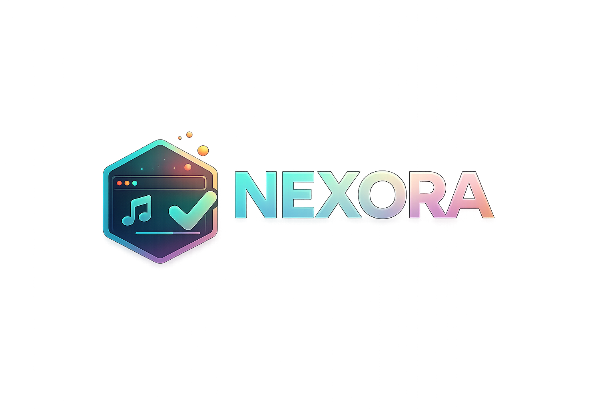

<p align="center">
  
</p>

<h1 align="center">Nexora</h1>

<p align="center">
  <strong>Build it. Style it. Stream it.</strong><br>
  Eine Django-Plattform zum Erstellen, Anpassen und Verwalten von Browser-Overlays für OBS.
</p>

<p align="center">
  
  
  
  
</p>

---

## ✨ Was ist Nexora?

**Nexora** macht aus konfigurierbaren Web-Elementen fertige Stream-Overlays. Du gestaltest dein Overlay im Browser, kopierst die erzeugte URL und fügst sie in OBS als **Browserquelle** ein.

Änderungen an Inhalt oder Design werden direkt über Nexora verwaltet. Die URL in deiner OBS-Szene bleibt dabei gleich.

> **Eine Plattform. Ein Link. Dein Stream-Design.**

## 🚀 Aktuelle Features

### 🎵 Spotify Overlay

Erstelle ein frei positionierbares Now-Playing-Overlay für deine Spotify-Wiedergabe.

- Drag-and-drop-basierter Overlay-Editor
- Frei definierbare Canvas-Größe
- Individuelle Farben, Transparenz, Rahmen und Rundungen
- Beliebig kombinierbare Elemente:
  - Cover
  - Songtitel
  - Interpret
  - Album
  - Fortschrittsbalken
  - Vergangene Zeit
  - Gesamtdauer
  - Wiedergabestatus
- Spotify-Verbindung über OAuth
- Öffentliche Browserquellen-URL für OBS
- Live-Abfrage des aktuellen Wiedergabestatus

### 🏆 Winchallenge Overlay

Verwalte Challenges für einzelne oder mehrere Spiele und zeige den Fortschritt live im Stream.

- Eigene Challenge-Namen
- Bis zu **20 Spiele** pro Challenge
- Separate Wins und Ziel-Wins pro Spiel
- Wins direkt erhöhen oder verringern
- Spiele umbenennen und löschen
- Automatische Gesamt-Win-Anzeige
- Fortschrittsanzeige pro Spiel
- Automatischer Seitenwechsel bei mehreren Spielen
- Drei Designvorlagen:
  - Minimal
  - Glass
  - Neon
- Anpassbare Farben, Abstände, Schriftgrößen, Rahmen und Schatten
- Flexible Overlay-Breite und optionale feste Höhe
- Öffentliche Browserquellen-URL mit Live-Aktualisierung

### 🌍 Allgemein

- Deutsche und englische Benutzeroberfläche
- Responsive, modernes Glass-Design
- Light- und Dark-Theme
- Öffentliche Overlay-URLs mit schwer erratbaren UUID-Tokens
- SQLite-Datenbank für die lokale Entwicklung
- Versionsanzeige über die Datei `VERSION`

## 🧭 So funktioniert es

```text
Overlay erstellen
      ↓
Design und Inhalte anpassen
      ↓
Browserquellen-URL kopieren
      ↓
URL in OBS einfügen
      ↓
Werte jederzeit über Nexora aktualisieren
```

## 🛠️ Lokale Installation

### Voraussetzungen

- Python 3.12 oder neuer
- `pip`
- Git, sofern du das Repository klonst
- Ein Spotify-Developer-Projekt für das Spotify-Overlay

### 1. Projekt vorbereiten

```bash
git clone <DEINE-REPOSITORY-URL>
cd Nexora
```

Alternativ kannst du das Projekt als ZIP herunterladen und entpacken.

### 2. Virtuelle Umgebung erstellen

**Windows PowerShell**

```powershell
python -m venv .venv
.\.venv\Scripts\Activate.ps1
```

**Linux / macOS**

```bash
python3 -m venv .venv
source .venv/bin/activate
```

### 3. Abhängigkeiten installieren

```bash
python -m pip install --upgrade pip
pip install -r requirements.txt
```

### 4. Umgebungsvariablen anlegen

Kopiere die Beispieldatei:

**Windows**

```powershell
Copy-Item .env.example .env
```

**Linux / macOS**

```bash
cp .env.example .env
```

Passe anschließend die Werte in `.env` an:

```env
DJANGO_SECRET_KEY=replace-with-a-long-random-secret
DJANGO_DEBUG=true

SPOTIFY_CLIENT_ID=your-spotify-client-id
SPOTIFY_CLIENT_SECRET=your-spotify-client-secret
SPOTIFY_REDIRECT_URI=http://127.0.0.1:8000/spotify/callback/
```

> Die Datei `.env` enthält sensible Zugangsdaten und darf nicht in Git eingecheckt werden.

### 5. Datenbank vorbereiten

```bash
python manage.py migrate
```

Optional kannst du einen Admin-Benutzer erstellen:

```bash
python manage.py createsuperuser
```

### 6. Entwicklungsserver starten

```bash
python manage.py runserver
```

Nexora ist danach unter folgender Adresse erreichbar:

```text
http://127.0.0.1:8000/
```

## 🎧 Spotify einrichten

1. Erstelle im Spotify Developer Dashboard eine App.
2. Öffne die Einstellungen der Spotify-App.
3. Trage exakt folgende Redirect-URI ein:

```text
http://127.0.0.1:8000/spotify/callback/
```

4. Übernimm `Client ID` und `Client Secret` in deine `.env`.
5. Starte den Django-Server neu.
6. Öffne ein Spotify-Overlay in Nexora und wähle **Mit Spotify verbinden**.

Für eine produktive Domain muss `SPOTIFY_REDIRECT_URI` sowohl in der `.env` als auch im Spotify Developer Dashboard auf dieselbe öffentliche HTTPS-Adresse geändert werden.

## 🎥 Overlay in OBS einfügen

1. Erstelle oder öffne ein Overlay in Nexora.
2. Kopiere die angezeigte Browserquellen-URL.
3. Öffne deine Szene in OBS.
4. Klicke unter **Quellen** auf `+`.
5. Wähle **Browser**.
6. Füge die Nexora-URL in das Feld **URL** ein.
7. Übernimm die für das Overlay empfohlene Breite und Höhe.
8. Aktiviere bei Bedarf **Browser aktualisieren, wenn Szene aktiv wird**.

Änderungen in Nexora werden anschließend vom Overlay übernommen, ohne dass die Quelle in OBS neu angelegt werden muss.

## 📁 Projektstruktur

```text
Nexora/
├── app/
│   ├── migrations/          # Datenbankmigrationen
│   ├── static/              # CSS, JavaScript, Bilder und Icons
│   ├── templates/           # Django-Templates und Overlay-Ansichten
│   ├── forms.py             # Formulare und Eingabevalidierung
│   ├── models.py            # Spotify- und Winchallenge-Modelle
│   ├── spotify_api.py       # Spotify OAuth und Playback API
│   ├── urls.py              # App-Routen
│   └── views.py             # Editor-, Verwaltungs- und Overlay-Views
├── locale/                  # Deutsche und englische Übersetzungen
├── nexora/                  # Django-Projektkonfiguration
├── .env.example             # Vorlage für Umgebungsvariablen
├── manage.py
├── requirements.txt
└── VERSION
```

## 🔗 Wichtige Routen

| Bereich | Route |
|---|---|
| Startseite | `/` |
| Über Nexora | `/about/` |
| Spotify-Overlays | `/spotify/` |
| Neues Spotify-Overlay | `/spotify/new/` |
| Winchallenges | `/winchallenges/` |
| Neue Winchallenge | `/winchallenges/new/` |
| Django-Admin | `/admin/` |

Die öffentlichen OBS-URLs werden pro Overlay über einen individuellen UUID-Token erzeugt.

## 🌐 Übersetzungen aktualisieren

Nach Änderungen an übersetzbaren Texten:

```bash
python manage.py makemessages -l de
python manage.py makemessages -l en
```

Anschließend die Übersetzungen in den jeweiligen `django.po`-Dateien bearbeiten und kompilieren:

```bash
python manage.py compilemessages
```

## ✅ Projekt prüfen

Django-Systemcheck ausführen:

```bash
python manage.py check
```

Tests starten:

```bash
python manage.py test
```

## 🔐 Hinweise für den Produktivbetrieb

Die aktuelle Konfiguration ist primär für die lokale Entwicklung ausgelegt. Vor einem öffentlichen Deployment solltest du mindestens:

- `DJANGO_DEBUG=false` setzen
- einen sicheren und einzigartigen `DJANGO_SECRET_KEY` verwenden
- `ALLOWED_HOSTS` konfigurieren
- ausschließlich HTTPS verwenden
- eine produktive Datenbank und ein Backup-Konzept einrichten
- statische Dateien über einen geeigneten Webserver ausliefern
- Spotify-Zugangsdaten ausschließlich als Umgebungsvariablen speichern
- Zugriffs- und Berechtigungskonzepte für private Verwaltungsseiten ergänzen

## 🗺️ Mögliche nächste Schritte

- Weitere Overlay-Typen wie Counter, Timer und Social Alerts
- Benutzerkonten mit persönlicher Overlay-Bibliothek
- Vorlagen-Galerie und teilbare Designs
- Overlay-Duplikation und Export/Import
- WebSocket-basierte Echtzeitupdates
- Docker-Setup für Deployment und Entwicklung
- Umfangreichere automatisierte Tests

## 🤝 Mitwirken

Ideen, Bugreports und Verbesserungsvorschläge sind willkommen.

1. Repository forken
2. Feature-Branch erstellen
3. Änderungen implementieren und testen
4. Aussagekräftigen Commit erstellen
5. Pull Request öffnen

## 📄 Lizenz

Für dieses Projekt ist aktuell keine Lizenzdatei hinterlegt. Ergänze vor einer öffentlichen Veröffentlichung eine passende `LICENSE`-Datei und passe diesen Abschnitt entsprechend an.

---

<p align="center">
  <strong>Nexora</strong><br>
  Create. Connect. Go live. ✦
</p>
