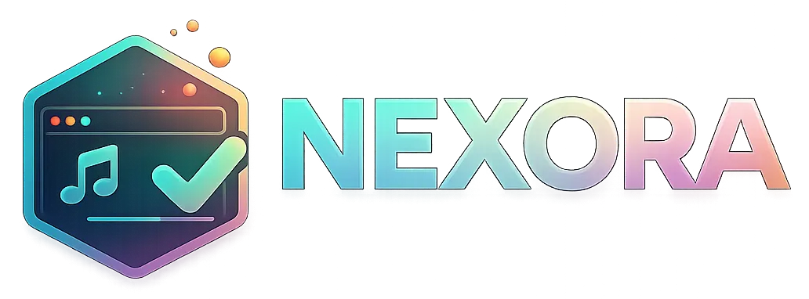

<p align="center">
  
</p>

<h1 align="center">Nexora</h1>

<p align="center">
  <strong>Build it. Style it. Stream it.</strong><br>
  A Django platform for creating, customizing, and managing browser overlays for OBS.
</p>

<p align="center">
  
  
  
  
</p>

---

## ✨ What is Nexora?

**Nexora** turns configurable web components into stream-ready overlays. Design an overlay in the browser, copy its generated URL, and add it to OBS as a **browser source**.

Content and design changes are managed directly in Nexora. The browser-source URL in your OBS scene remains unchanged.

> **One platform. One link. Your stream design.**

## 🚀 Features

### 🎵 Spotify overlay

Create a freely positioned now-playing overlay for your Spotify playback.

- Drag-and-drop visual editor
- Configurable canvas dimensions
- Custom colors, opacity, borders, and corner radii
- Freely combinable elements:
  - Artwork
  - Track title
  - Artist
  - Album
  - Progress bar
  - Elapsed time
  - Total duration
  - Playback status
- Spotify connection through OAuth
- One shared Spotify connection per account
- Encrypted access and refresh tokens
- Shared short-lived playback cache across Spotify overlays
- Public OBS browser-source URL
- Live playback updates

### 🏆 Win Challenge overlay

Manage challenges for one or more games and display their progress live on stream.

- Custom challenge titles
- Up to **20 games** per challenge
- Separate current wins and target wins for each game
- Direct win increment and decrement controls
- Rename and delete games
- Automatic total-win calculation
- Per-game progress indicators
- Automatic pagination for larger game lists
- Three design presets:
  - Minimal
  - Glass
  - Neon
- Configurable colors, spacing, font sizes, borders, and shadows
- Flexible overlay width and optional fixed height
- Public browser-source URL with live updates

### ⏱️ Stream Timer overlay

Create a persistent countdown or stopwatch and control it live without replacing the OBS browser source.

- Countdown and stopwatch modes
- Start, pause, and reset controls
- Server-persisted runtime that survives browser reloads
- Hours, minutes, and seconds configuration
- Optional label and progress bar
- Three design presets:
  - Minimal
  - Glass
  - Neon
- Configurable colors, opacity, borders, sizes, and shadows
- Public OBS browser-source URL with smooth local time updates
- Duplicate and JSON import/export support

### 🌍 Platform

- German and English user interface
- Responsive glass-style design
- Light and dark themes
- User accounts with private overlay libraries
- Owner-based access control for all management pages and actions
- Public OBS overlay URLs protected by hard-to-guess UUID tokens
- Regeneratable public OBS URLs for immediate revocation
- Conditional state requests with overlap prevention and error backoff
- Automatic version history with the 30 most recent distinct states and one-click restore
- Built-in font presets including Arial, Verdana, Georgia, Times New Roman, and Courier New
- Reusable custom fonts, logos, and background images across all overlay types
- Validated image uploads (PNG, JPEG, WebP up to 5 MB) and font uploads (WOFF, WOFF2, TTF, OTF up to 3 MB)
- Automatic adoption of existing ownerless overlays by the first registered account
- SQLite database for local development
- Version display based on the `VERSION` file

## 🧭 How it works

```text
Create an account
      ↓
Create an overlay
      ↓
Customize its design and content
      ↓
Copy the browser-source URL
      ↓
Add the URL to OBS
      ↓
Update values in Nexora whenever needed
```

Management pages require an authenticated account. Public UUID-based overlay URLs remain accessible to OBS without a login.

## 🛠️ Local installation

### Requirements

- Python 3.12 or newer
- `pip`
- Git when cloning the repository
- A Spotify Developer app when using the Spotify overlay

### 1. Prepare the project

```bash
git clone <YOUR-REPOSITORY-URL>
cd Nexora
```

You can also download and extract the project as a ZIP archive.

### 2. Create a virtual environment

**Windows PowerShell**

```powershell
python -m venv .venv
.\.venv\Scripts\Activate.ps1
```

**Linux / macOS**

```bash
python3 -m venv .venv
source .venv/bin/activate
```

### 3. Install dependencies

```bash
python -m pip install --upgrade pip
pip install -r requirements.txt
```

### 4. Configure environment variables

Copy the example environment file:

**Windows PowerShell**

```powershell
Copy-Item .env.example .env
```

**Linux / macOS**

```bash
cp .env.example .env
```

Update the values in `.env`:

```env
DJANGO_SECRET_KEY=replace-with-a-long-random-secret
DJANGO_DEBUG=true
DJANGO_ALLOWED_HOSTS=localhost,127.0.0.1
DJANGO_CSRF_TRUSTED_ORIGINS=http://127.0.0.1:8000
SQLITE_PATH=
DJANGO_MEDIA_ROOT=

SPOTIFY_CLIENT_ID=your-spotify-client-id
SPOTIFY_CLIENT_SECRET=your-spotify-client-secret
SPOTIFY_REDIRECT_URI=http://127.0.0.1:8000/spotify/callback/
SPOTIFY_TOKEN_ENCRYPTION_KEY=
SPOTIFY_PLAYBACK_CACHE_SECONDS=8
```

> `.env` contains sensitive credentials and must never be committed to Git.
>
> `.env.example` is prepared for the Docker server. For local development, use
> the values above: `DJANGO_DEBUG=true` and an empty `SQLITE_PATH` keep using the
> local `db.sqlite3`.

### 5. Prepare the database

```bash
python manage.py migrate
```

You can optionally create an administrator account for the Django admin:

```bash
python manage.py createsuperuser
```

### 6. Start the development server

```bash
python manage.py runserver
```

Nexora is now available at:

```text
http://127.0.0.1:8000/
```

Create a regular Nexora account at:

```text
http://127.0.0.1:8000/accounts/signup/
```

The first registered account automatically becomes the owner of existing overlays that do not yet have an owner.

## 🎧 Spotify setup

1. Create an app in the [Spotify Developer Dashboard](https://developer.spotify.com/dashboard).
2. Open the Spotify app settings.
3. Add this exact redirect URI:

```text
http://127.0.0.1:8000/spotify/callback/
```

4. Add the Spotify `Client ID` and `Client Secret` to `.env`.
5. Restart the Django server.
6. Open a Spotify overlay in Nexora and select **Connect with Spotify**.

For a production domain, `SPOTIFY_REDIRECT_URI` must use the same public HTTPS URL in both `.env` and the Spotify Developer Dashboard.

Spotify tokens are encrypted before they are stored. If
`SPOTIFY_TOKEN_ENCRYPTION_KEY` is empty, Nexora derives a stable key from
`DJANGO_SECRET_KEY`. For production, set a dedicated Fernet key before applying
migration `0011` for the first time, then keep it stable across deployments.
Changing either the configured encryption key or its `DJANGO_SECRET_KEY`
fallback afterwards makes existing Spotify tokens unreadable and requires users
to reconnect Spotify:

```bash
python -c "from cryptography.fernet import Fernet; print(Fernet.generate_key().decode())"
```

## 🎥 Add an overlay to OBS

1. Create or open an overlay in Nexora.
2. Copy its browser-source URL.
3. Open your OBS scene.
4. Select `+` in the **Sources** panel.
5. Choose **Browser**.
6. Paste the Nexora URL into the **URL** field.
7. Apply the recommended width and height shown in Nexora.
8. Optionally enable **Refresh browser when scene becomes active**.

Future changes made in Nexora are picked up by the overlay without recreating the source in OBS.

Each editor also keeps a server-side history of saved states. Restoring an older
state first preserves the current state, so the operation remains reversible.
Uploaded branding files belong to the signed-in account and are selected through
random token URLs that work in OBS without exposing the media directory itself.

## 📁 Project structure

```text
Nexora/
├── app/
│   ├── migrations/          # Database migrations
│   ├── static/              # CSS, JavaScript, images, and icons
│   ├── templates/           # Pages, editors, authentication, and overlays
│   ├── forms.py             # Forms and input validation
│   ├── models.py            # Spotify, timer, and Win Challenge models
│   ├── overlay_versions.py  # Version snapshots, retention, and restore logic
│   ├── spotify_api.py       # Spotify OAuth and playback API client
│   ├── upload_validators.py # Image and font upload validation
│   ├── urls.py              # Application routes
│   ├── views/               # Feature-oriented HTTP views
│   │   ├── common.py        # Shared OBS, ETag, export, and response helpers
│   │   ├── dashboard.py     # Shared overlay dashboard and imports
│   │   ├── pages.py         # Public pages and authentication
│   │   ├── spotify.py       # Spotify management and public overlay views
│   │   ├── timer.py         # Timer management and public overlay views
│   │   └── winchallenge.py  # Win Challenge management and overlay views
│   └── e2e_tests.py         # Playwright editor and OBS browser tests
├── locale/                  # German and English translations
├── nexora/                  # Django project configuration
├── compose.yml              # Docker Compose service
├── Dockerfile               # Production container image
├── docker-entrypoint.sh     # Migrations and static collection on startup
├── .env.example             # Environment variable template
├── manage.py
├── .github/                 # CI workflow and Dependabot configuration
├── LICENSE                  # MIT license
├── pyproject.toml           # Ruff and Coverage configuration
├── requirements.txt         # Runtime dependencies
├── requirements-dev.txt     # Development and test dependencies
└── VERSION
```

## 🔗 Important routes

| Area | Route | Access |
|---|---|---|
| Home | `/` | Public |
| About | `/about/` | Public |
| Sign in | `/accounts/login/` | Public |
| Create account | `/accounts/signup/` | Public |
| Spotify overlays | `/spotify/` | Authenticated |
| New Spotify overlay | `/spotify/new/` | Authenticated |
| Stream timers | `/timers/` | Authenticated |
| New stream timer | `/timers/new/` | Authenticated |
| Win Challenges | `/winchallenges/` | Authenticated |
| New Win Challenge | `/winchallenges/new/` | Authenticated |
| Django admin | `/admin/` | Staff |

Public OBS routes are generated individually for each overlay and use UUID tokens.

## 🌐 Update translations

Extract translatable strings after changing Python or template text:

```bash
python manage.py makemessages -l de
python manage.py makemessages -l en
```

Edit the generated `django.po` files and compile them:

```bash
python manage.py compilemessages
```

## ✅ Quality checks

Install the development dependencies once:

```bash
pip install -r requirements-dev.txt
```

Run formatting, linting, unit tests, and the 80% branch-coverage gate:

```bash
ruff format .
ruff check .
coverage run manage.py test
coverage report
```

Run the Chromium editor and OBS browser-source tests separately:

```bash
python -m playwright install chromium
python manage.py test app.e2e_tests
```

Audit the pinned runtime dependencies:

```bash
pip-audit --requirement requirements.txt
```

GitHub Actions runs Ruff, coverage, migration checks, `collectstatic`, the
dependency audit, Playwright, and a complete Docker image build for every pull
request and every push to `main`. Dependabot checks Python, Actions, and Docker
dependencies weekly.

## ✅ Project checks

Run the Django system check:

```bash
python manage.py check
```

Run the automated test suite:

```bash
python manage.py test
```

Check for missing model migrations:

```bash
python manage.py makemigrations --check --dry-run
```

## Docker-Bereitstellung im Heimnetz

Die Docker-Konfiguration startet Nexora mit Gunicorn, stellt statische Dateien
über WhiteNoise bereit und speichert SQLite dauerhaft unter
`~/docker/Nexora/data/db.sqlite3`. Auf dem Linux-Server werden Docker Engine,
das Compose-Plugin und Git benötigt.

### Erstinstallation

Mit `BENUTZERNAME` ist der Linux-Benutzer auf dem Server gemeint:

```bash
ssh BENUTZERNAME@192.168.178.175

mkdir -p ~/docker
cd ~/docker
git clone https://github.com/YannikFroehlich/Nexora.git
cd Nexora

cp .env.example .env
nano .env

mkdir -p data
docker compose up -d --build
docker compose ps
docker compose logs -f web
```

Ersetze in `.env` insbesondere den Beispielwert von `DJANGO_SECRET_KEY`. Einen
sicheren Wert kannst du ohne eine systemweite Django-Installation mit Python
erzeugen:

```bash
python3 -c "import secrets; print(secrets.token_urlsafe(64))"
```

Falls auf dem Server noch kein Python 3 installiert ist, funktioniert alternativ
das offizielle Python-Image:

```bash
docker run --rm python:3.12-slim python -c "import secrets; print(secrets.token_urlsafe(64))"
```

Die wesentlichen Serverwerte in `.env` sind:

```env
DJANGO_DEBUG=false
DJANGO_ALLOWED_HOSTS=192.168.178.175,localhost,127.0.0.1
DJANGO_CSRF_TRUSTED_ORIGINS=http://192.168.178.175:8001
SQLITE_PATH=/app/data/db.sqlite3
DJANGO_MEDIA_ROOT=/app/data/media

DJANGO_SECURE_SSL_REDIRECT=false
DJANGO_SESSION_COOKIE_SECURE=false
DJANGO_CSRF_COOKIE_SECURE=false
DJANGO_SECURE_HSTS_SECONDS=0

SPOTIFY_REDIRECT_URI=
SPOTIFY_TOKEN_ENCRYPTION_KEY=
SPOTIFY_PLAYBACK_CACHE_SECONDS=8
```

Der Container läuft als Benutzer mit UID/GID `1000`. Bei einem abweichenden
Server-Benutzer und einem Berechtigungsfehler kann der Datenordner einmalig
angepasst werden:

```bash
sudo chown -R 1000:1000 ~/docker/Nexora/data
```

Nexora ist anschließend unter
`http://192.168.178.175:8001` erreichbar.

### Betrieb und Administration

```bash
cd ~/docker/Nexora

docker compose ps
docker compose logs -f web
docker compose exec web python manage.py createsuperuser
docker compose exec web python manage.py check
docker compose restart
docker compose down
```

`docker compose down` entfernt den Container und das Netzwerk, aber nicht die
per Bind-Mount gespeicherte Datenbank und Branding-Dateien im lokalen
`data`-Ordner.

### Updates einspielen

```bash
cd ~/docker/Nexora
git pull
docker compose up -d --build
docker compose logs --tail=100 web
```

Migrationen und `collectstatic --noinput` laufen bei jedem neu gestarteten
Container automatisch vor Gunicorn.

### SQLite-Datenbank sichern

Für eine konsistente einfache Dateikopie sollte der Web-Container während des
Backups gestoppt sein:

```bash
cd ~/docker/Nexora
docker compose stop web
cp data/db.sqlite3 "data/db.sqlite3.backup-$(date +%Y%m%d-%H%M%S)"
docker compose start web
```

Bewahre zusätzliche Kopien der Backups außerhalb dieses Servers auf.

### Bestehende lokale Datenbank auf den Server kopieren

Stoppe zuerst auf dem Server den Container, damit während des Austauschs keine
Schreibzugriffe stattfinden:

```bash
ssh BENUTZERNAME@192.168.178.175
cd ~/docker/Nexora
docker compose stop web
```

Kopiere danach auf deinem lokalen Windows-Rechner in PowerShell die vorhandene
Datenbank an das persistente Ziel:

```powershell
scp .\db.sqlite3 BENUTZERNAME@192.168.178.175:~/docker/Nexora/data/db.sqlite3
```

Starte den Container anschließend auf dem Server wieder. Der Entrypoint wendet
noch fehlende Migrationen an:

```bash
cd ~/docker/Nexora
docker compose start web
docker compose logs --tail=100 web
```

Eine vorhandene Serverdatenbank sollte vor dem Überschreiben wie oben beschrieben
gesichert werden. Die lokale `db.sqlite3` wird durch `.dockerignore` ausdrücklich
nicht in das Image kopiert.

### Spotify konfigurieren

Aus Sicht von Nexora liegt der Callback beim aktuellen Zugriff im Heimnetz unter:

```text
http://192.168.178.175:8001/spotify/callback/
```

Spotify akzeptiert HTTP-Redirects jedoch nur für Loopback-Adressen wie
`127.0.0.1`, nicht für eine private LAN-IP. Deshalb sollte
`SPOTIFY_REDIRECT_URI` auf dem Server zunächst leer bleiben. Für funktionierendes
Spotify OAuth benötigt die Server-Bereitstellung eine HTTPS-Domain vor einem
Reverse Proxy. Die spätere HTTPS-Callback-URI muss dann in `.env` und im Spotify
Developer Dashboard exakt identisch eingetragen werden.

Für die lokale Entwicklung ist weiterhin diese erlaubte Loopback-URI geeignet:

```env
SPOTIFY_REDIRECT_URI=http://127.0.0.1:8000/spotify/callback/
```

Trage außerdem `SPOTIFY_CLIENT_ID` und `SPOTIFY_CLIENT_SECRET` aus der Spotify-App
in `.env` ein und starte den Container nach einer späteren Server-Konfiguration
neu:

```bash
docker compose restart
```

Bei der HTTPS-Bereitstellung müssen `SPOTIFY_REDIRECT_URI`,
`DJANGO_ALLOWED_HOSTS`, `DJANGO_CSRF_TRUSTED_ORIGINS` und die optionalen
Cookie-/HTTPS-Sicherheitseinstellungen gemeinsam auf die HTTPS-Adresse umgestellt
werden.

## 🔐 Production notes

The configuration supports both local development and the Docker deployment
described above. Before exposing Nexora publicly, at minimum:

- Set `DJANGO_DEBUG=false`
- Use a long, unique `DJANGO_SECRET_KEY`
- Configure `ALLOWED_HOSTS`
- Serve the application exclusively over HTTPS
- Enable secure session and CSRF cookies
- Configure HSTS and HTTPS redirects carefully
- Use a production-ready database and backup strategy
- Put the application behind a maintained HTTPS reverse proxy
- Keep Spotify credentials outside the repository
- Keep `SPOTIFY_TOKEN_ENCRYPTION_KEY` stable and outside the repository
- Protect open registration with invitations, email verification, or rate limiting when required

## 🗺️ Possible next steps

- Additional overlay types such as counters, goals, lower thirds, and social alerts
- Account recovery and profile management
- Template gallery and reusable personal presets
- WebSocket- or Server-Sent Events-based live updates
- Visual regression snapshots for multiple overlay themes and resolutions

## 🤝 Contributing

Ideas, bug reports, and improvements are welcome.

1. Fork the repository.
2. Create a focused feature branch.
3. Implement and test your changes.
4. Create a concise, meaningful commit.
5. Open a pull request with a description and relevant screenshots.

## 📄 License

Nexora is distributed under the [MIT License](LICENSE).

---

<p align="center">
  <strong>Nexora</strong><br>
  Create. Connect. Go live. ✦
</p>
